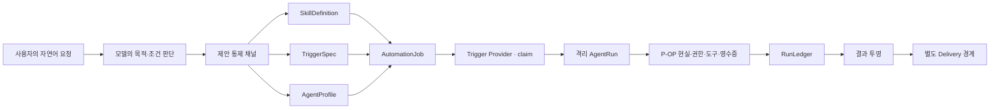

# T5 Skill·Trigger·Agent Automation 구현 계획

- 작성: 2026-07-29
- 지위: **AC-1 채택 이력 + 후속 재계획 입력**
- 적용 시점: AC-1은 정본 편입 완료. AC-2 이후는 T-cell H 봉인과 현재 코어 대조 뒤 재개
- 출시 경계: 인간 베타와 설치 패키지 제작 전에 이 문서의 Core Closure를 통과해야 한다
- 구현 원칙: 스킬, 크론, 에이전트를 세 기능으로 덧붙이지 않고 하나의 실행 원리로 만든다
- 상위 정본:
  - `GPAO-T5-DEVELOPMENT-ABSOLUTE-PRINCIPLES-2026-07-24-ko.md`
  - `docs/03-product-plan/GPAO-T5-VISION-AND-PERFORMANCE-PHILOSOPHY-2026-07-27-ko.md`
  - `GPAO-T5-MODEL-OS-OPERATING-LOOP-2026-07-27-ko.md`
  - `GPAO-T5-P-OP-REFERENCE-ABSORPTION-SUPPLEMENT-2026-07-28-ko.md`
  - `design/T5-TCELL-DEVELOPMENT-PLAN-2026-07-31-ko.md`(S0~S5 구현 계약). 과거 명세는
    `docs/archive/retired-plans/`에 있으며 구현 근거로 쓰지 않는다.

> **새 개발 세션은 이 문서를 스쳐 지나가면 안 된다.**
>
> 스킬, 반복 실행, 예약 실행, 장기 작업 위임, 에이전트 생성, 자동화 UI, background service,
> T-cell의 automation learning 가운데 하나라도 건드리기 전에 이 문서를 읽는다.
>
> 이 문서는 T-cell 구현 계약을 대체하지 않는다. AC-1 이후 순서는 과거 병렬 결정을 그대로 실행하지
> 않고, H 봉인된 T-cell 스키마와 현재 권한·원장·복구 경계를 다시 대조한 뒤 고정한다.

---

## 0. 결정 요약

스킬, 크론, 에이전트 생성은 T5의 부가 기능이 아니다. 일반 사용자가 개발자가 되지 않고도 반복 업무,
장기 조사, 정기 보고, 후속 확인을 맡길 수 있게 하는 **핵심 자동화 기관**이다.

다만 셋을 각각 개발하면 다음 중복이 생긴다.

- 스킬마다 별도 실행기
- 크론마다 별도 권한·복구 체계
- 에이전트마다 별도 모델·도구·원장
- 같은 실패와 승인을 세 곳에서 다르게 처리

T5는 다음 한 구조로 해결한다.

```text
SkillDefinition = 무엇을 어떻게 할지
TriggerSpec     = 언제 시작할지
AgentProfile    = 어떤 역할·모델·손·범위로 수행할지
AutomationJob  = 위 셋을 사용자 승인 범위 안에서 묶은 약속
AgentRun        = 약속을 실제로 수행하는 격리된 한 회차
RunLedger       = 그 회차에서 실제로 일어난 일
```

핵심 식:

```text
사용자 말
→ 모델이 목적·조건을 이해
→ OS가 Skill / Trigger / Agent 제안으로 구조화
→ 사용자가 실제 문면·대상·범위·시점을 확인
→ 영속 Job
→ 시점 도달
→ 격리 AgentRun
→ 기존 P-OP 권한·도구·영수증·복구 경계
→ 결과와 다음 길
```

스케줄러는 도구를 직접 실행하지 않는다. 에이전트는 권한을 스스로 넓히지 않는다. 스킬은 자동 실행
권한이 아니다. 외부 전달은 작업 성공과 별도 단계다. 이 네 문장이 전체 구조의 중심이다.

---

## 1. 착수 순서와 현재 작업 보호

### 1.1 지금 즉시 섞지 않을 것

P-OP-7은 최종 PASS와 오너 승인을 마쳤고 AC-1도 정본에 편입됐다. 현재는 T-cell 전면 롤백 뒤 새 계획
작성 전이므로 AC-2 이후 제품 코드를 같은 변경 묶음에 섞지 않는다.

```text
P-OP-7 최종 PASS [완료]
→ AC-1 공통 계약·migration [완료]
→ 새 T-cell 계획·구현·검증
→ AC-2 이후 스킬·트리거·에이전트·자동화 재개
```

이는 자동화를 미루는 결정이 아니다. 자동화가 반복해서 사용할 P-OP의 승인·실행·전달·복구 바닥을 먼저
고정하는 최소 순서다.

### 1.2 최신 오너 우선순위

이전 흡수 문서에는 skill/plugin 생태계를 인간 테스트·설치·T-cell 뒤의 확장으로 묶어 둔 문장이 있다.
여기서 둘을 분리한다.

- **지금 우선**: 사용자가 자연어로 만들고 승인하는 T5 내장 스킬, 지속 예약, 제한된 에이전트 실행
- **나중**: 외부 skill/plugin 시장, 타사 패키지 설치, 팀 단위 에이전트 군집, 다중 장치 생태계

Core Closure는 인간 베타·설치 패키지 전에 한다. 생태계 확장은 그 뒤다.

---

## 2. 세 저장소 재감사 기준선

### 2.1 감사 기준선

| 저장소 | 감사 커밋 | 집중 검토 |
|---|---|---|
| T5 | `1416ec3b2a55e051a6d336058e66efd7da184a45` | 현재 skill lifecycle, automation engine/scheduler, model role seam, P-OP 계약 |
| OpenClaw | `27f05c8993fb18ad6d65a5912d50966594d9662c` | Skill Workshop, cron, isolated run, subagent, agent profile |
| Hermes | `a61183b56fdb45b9d2a0f2f6b8482e665ccf702f` | profile cron, execution ledger, claim/heartbeat/recovery, delegate isolation |

이 감사는 문서 제목만 비교하지 않았다. 아래 실제 구현과 운영 문서를 읽고 T5 계약으로 번역했다.

### 2.2 T5 현재 자산

| 현재 자산 | 이미 잘된 점 | 아직 비어 있는 점 |
|---|---|---|
| `src/kernel/l5-growth/skill-learning.js` | 후보와 admitted 분리, 확인+replay 전 영향 0, 자동 실행 권한 0 | replay가 실제 실행 재생이 아니라 구조 확인, 반복 감지가 단순, 버전·hash·rollback 없음 |
| `src/kernel/l5-growth/automation.js` | 승인 범위·만료·취소·backoff·원장, A3 무인 실행 차단 | interval 중심, timezone·calendar·misfire·claim·실행 단위가 없음 |
| `src/runtime/automation-engine.js` | ToolRunner와 같은 권한·영수증 경계 재사용 | scheduler가 job action을 직접 실행, 격리 context·취소·run identity 부족 |
| `src/runtime/automation-scheduler.js` | 중복 start 차단, trusted runtime event | `setInterval`뿐이며 프로세스가 죽으면 함께 멈춤, 재시작 회복 없음 |
| `src/surface/model-connection.js` | `modelFor(role)`로 역할별 모델 선택 가능 | 역할을 가진 AgentProfile·AgentRun 객체 없음 |
| P-OP | 승인 정확히 한 번, 전달 분리, 중단·승계, 실패 정직성 | 이 계약을 영속 자동화와 독립 실행에 아직 관통시키지 않음 |

현재 자동화는 틀린 것이 아니라 **안전한 첫 슬라이스**다. 이제 그 계약을 버리지 않고 제품 수준으로
확장해야 한다.

---

## 3. OpenClaw에서 흡수할 것

### 3.1 Skill Workshop

근거:

- `../lab_un/openclaw-pure-2026-07-20/docs/tools/skill-workshop.md`
- proposal은 `PROPOSAL.md`, apply만 live write
- update는 현재 target hash에 묶이고 target이 바뀌면 stale
- apply 전에 scanner를 다시 통과
- live write 전에 rollback metadata 저장

T5가 흡수할 계약:

1. 모델이나 에이전트가 활성 스킬을 직접 덮어쓰지 않는다.
2. 생성·수정은 항상 proposal이다.
3. proposal은 대상 버전/hash에 묶인다.
4. 실제 replay와 사용자 확인 뒤에만 active가 된다.
5. 적용 전에 이전 버전을 복구 가능하게 보관한다.
6. chat·설정·API는 같은 lifecycle service를 호출한다.

그대로 복제하지 않을 것:

- SKILL.md 파일 형식을 T5의 내부 정본으로 강제
- 거대한 skill marketplace와 curator
- 사용 횟수만으로 자동 archive하는 정책
- OpenClaw workspace·plugin 경로 구조

### 3.2 Cron과 isolated run

근거:

- `../lab_un/openclaw-pure-2026-07-20/docs/automation/cron-jobs.md`
- job·runtime state·run history가 재시작 뒤에도 유지
- cron execution마다 background task/run identity 생성
- timeout, cancellation, duplicate run-id, cleanup
- schedule과 payload와 delivery가 분리
- isolated run은 fresh session에서 실행

T5가 흡수할 계약:

1. 예약 정의와 실제 실행 회차를 분리한다.
2. 각 회차에 안정적인 `runId`와 idempotency key가 있다.
3. 재시작 뒤 overdue job을 무작정 전부 재실행하지 않는다.
4. 실행 시간·도구 호출·출력 크기에 상한이 있다.
5. 실행 성공과 결과 전달 성공을 같은 상태로 합치지 않는다.
6. active run은 취소할 수 있고, 종료 뒤 자원을 정리한다.

그대로 복제하지 않을 것:

- 수십 개 cron 옵션과 CLI 문법
- main/custom/isolated session의 모든 변형
- 채널별 delivery syntax
- command/script/webhook payload를 첫 버전에 모두 넣기

### 3.3 Subagent와 agent profile

근거:

- `../lab_un/openclaw-pure-2026-07-20/docs/tools/subagents.md`
- `../lab_un/openclaw-pure-2026-07-20/src/agents/agent-create.ts`

T5가 흡수할 계약:

1. 자식 실행은 fresh context가 기본이다.
2. 모델·도구·작업 폴더·시간·비용·깊이를 명시한다.
3. 자식의 결과는 부모 작업으로 돌아온다.
4. 외부 전달 책임은 기본적으로 부모/사용자 경계에 남긴다.
5. persistent agent profile 생성은 이름·경로·binding 충돌을 원자적으로 검사한다.

첫 버전에서 제한할 것:

- worktree·ACP·원격 runtime·에이전트 팀
- 자식이 자식을 만드는 재귀 위임
- 여러 채널에 직접 결과 전달
- 독립된 인격·장기기억을 가진 무제한 상주 에이전트

---

## 4. Hermes에서 흡수할 것

### 4.1 영속 cron과 실행 원장

근거:

- `../lab_un/hermes-agent/cron/jobs.py`
- `../lab_un/hermes-agent/cron/executions.py`
- `../lab_un/hermes-agent/cron/scheduler_provider.py`

T5가 흡수할 계약:

1. 자동화 저장소는 사용자/profile 범위에 묶인다.
2. job 수정은 원자 저장과 단일 writer 경계를 따른다.
3. trigger provider는 **언제**만 결정하고 실행기를 소유하지 않는다.
4. 실행 전 compare-and-set claim으로 한 회차를 한 실행자만 가져간다.
5. ticker와 active run은 heartbeat를 남긴다.
6. 재시작 뒤 owner process가 죽은 것이 증명된 회차만 `unknown`으로 전이한다.
7. `completed/failed/cancelled/unknown` terminal state는 다시 덮어쓰지 않는다.
8. trigger 실패, run 실패, delivery 실패를 분리한다.

특히 `unknown`은 실패가 아니다. 외부 효과가 일어났는지 증명할 수 없다는 정직한 상태다. T5는 이를
성공이나 실패로 추측하지 않는다.

### 4.2 제한된 자식 실행

근거:

- `../lab_un/hermes-agent/tools/delegate_tool.py`
- 기본 자식은 delegation, messaging, cron, memory 도구를 잃음
- 부모보다 넓은 toolset을 얻지 못함
- 기본 깊이 1, active child interrupt 지원
- child는 fresh context와 별도 iteration budget 사용

T5가 흡수할 계약:

1. 자식은 부모에게 없는 손을 얻지 못한다.
2. 자식의 기본 금지 능력:
   - 다른 에이전트 생성
   - 새 자동화 등록
   - 장기 기억 쓰기
   - 외부 메시지 전송
   - 권한 범위 확대
3. 자식은 별도 context/tool budget/time budget을 가진다.
4. 부모 중단은 자식에 전파된다.
5. 사용자는 진행 상태와 취소 가능 여부를 볼 수 있다.

그대로 복제하지 않을 것:

- Kanban task graph
- 여러 provider/backend 옵션 전체
- agent가 skill 파일을 바로 만드는 경로
- scanner와 사용자 apply 없이 자기개선하는 설정

---

## 5. 하나의 T5 구조



### 5.1 왜 이 구조가 T5 철학과 맞는가

- 모델은 사용자의 말과 환경을 보고 `무엇을/언제/누가`를 판단한다.
- Runtime은 문장별 대본으로 판단을 빼앗지 않는다.
- Runtime은 가능한 손, 실제 상태, 승인 범위, 현재 스킬 버전, 실행 영수증을 정확히 공급한다.
- 위험은 기능 삭제가 아니라 AgentRun의 authority envelope에서 다룬다.
- 같은 실행기가 수동 실행, 예약 실행, 위임 실행을 모두 처리한다.

### 5.2 핵심 객체

#### `SkillDefinition`

```js
{
  schemaVersion: 1,
  id,
  name,
  purpose,
  version,
  contentHash,
  inputs,
  steps,
  resultContract,
  requiredCapabilities,
  authorityHints,
  replayCases,
  source: { kind, sessionId, traceIds },
  state,
  createdAt,
  updatedAt,
  previousVersion
}
```

`steps`는 강제 대본이 아니다. 모델이 현재 현실에 맞게 수행할 때 참고할 작업 원리와 확인 지점이다.
현재 사용자 지시와 실제 환경이 항상 우선한다.

#### `TriggerSpec`

```js
{
  kind: 'once' | 'interval' | 'daily' | 'weekly',
  timezone,
  at,
  intervalMs,
  weekdays,
  localTime,
  misfirePolicy: 'skip' | 'catch_up_once',
  nextRunAt
}
```

첫 버전은 사용자가 실제로 많이 쓰는 네 종류만 지원한다. 임의 cron expression은 직접 파서를 만들지
않는다. 필요성이 확인되면 검증된 parser를 의존성 감사 뒤 adapter로 추가한다.

#### `AgentProfile`

```js
{
  schemaVersion: 1,
  id,
  name,
  purpose,
  modelRole,
  toolAllowlist,
  workspaceScope,
  defaultBudgets,
  authorityCeiling,
  state: 'proposed' | 'active' | 'paused' | 'retired',
  createdAt,
  updatedAt
}
```

AgentProfile은 권한이 아니다. 실행 때마다 현재 연결·손·사용자 승인으로 다시 제한된다.

#### `AutomationJob`

```js
{
  schemaVersion: 1,
  id,
  name,
  skillRef: { id, version, contentHash },
  trigger,
  agentProfileId,
  inputTemplate,
  authorityEnvelope,
  deliveryPolicy,
  state,
  nextRunAt,
  lastRunId,
  createdAt,
  updatedAt
}
```

Job은 활성 스킬의 현재 버전을 느슨하게 참조하지 않는다. 승인 당시의 정확한 version/hash에 묶인다.
스킬이 바뀌면 job은 조용히 새 버전을 쓰지 않고 `needs_review`가 된다.

#### `AgentRun`

```js
{
  schemaVersion: 1,
  id,
  jobId,
  scheduledFor,
  idempotencyKey,
  skillSnapshot,
  triggerSnapshot,
  agentSnapshot,
  authorityEnvelope,
  status,
  owner,
  heartbeatAt,
  budgets,
  receipts,
  result,
  deliveryState,
  startedAt,
  finishedAt
}
```

실행 당시 snapshot을 보존해야 나중에 “어떤 방법과 권한으로 실행됐는가”를 재구성할 수 있다.

---

## 6. 상태 기계

### 6.1 Skill

```text
proposed
→ replay_required
→ approved
→ active
→ paused | retired

어느 단계에서든:
rejected | quarantined

대상 hash 변경:
stale
```

실제 replay는 최소 세 종류다.

- positive: 기대한 결과가 나오는가
- negative: 관련 없는 요청에 침범하지 않는가
- boundary: 권한·대상·실패 경계를 넘지 않는가

### 6.2 AutomationJob

```text
proposed → approved → scheduled ↔ paused → cancelled | expired
                                 ↘ needs_review
```

`running`은 Job 상태가 아니라 AgentRun 상태다. 반복 job 하나에 여러 run history가 생기므로 둘을
합치지 않는다.

### 6.3 AgentRun

```text
queued → claimed → running → succeeded
                     ├────→ waiting_approval
                     ├────→ failed
                     ├────→ cancelled
                     └────→ unknown
```

terminal state는 불변이다. 같은 scheduled occurrence의 재시도는 새 run이 아니라 같은 idempotency
범위의 attempt로 기록한다.

---

## 7. 권한과 안전

### 7.1 Authority Envelope

```js
{
  ceiling: 'A0' | 'A1' | 'A2',
  allowedKinds,
  allowedTargets,
  workspaceRoots,
  expiresAt,
  maxRuns,
  maxCost,
  requiresFreshApprovalFor
}
```

규칙:

1. AgentRun은 이 범위를 확대할 수 없다.
2. 대상·문면·범위가 승인 때와 달라지면 멈추고 새 승인을 요청한다.
3. A3는 무인 실행하지 않는다.
4. A2 반복 실행은 대상·행동·범위·만료가 정확히 고정된 경우만 허용한다.
5. 외부 전달은 `deliveryPolicy`와 현재 승인 경계를 다시 통과한다.
6. “스킬이 승인됨”은 “그 스킬의 모든 실행이 승인됨”이 아니다.

### 7.2 자식 에이전트 기본 deny

AgentRun의 기본 도구 목록에서 다음을 제외한다.

- `agent.create`
- `agent.delegate`
- `automation.create`
- `automation.modify`
- `memory.propose`
- `memory.confirm`
- 외부 `send` 도구

필요하면 부모가 정확한 한 회차에만 좁은 권한을 준다. 자식은 그 권한을 다음 회차에 보존하지 않는다.

---

## 8. 영속성·선점·복구

### 8.1 저장 원칙

- 기존 T5 단일 writer와 원자 저장 계약을 재사용한다.
- 모든 레코드에 `schemaVersion`을 둔다.
- 자격·토큰은 복사하지 않고 connector/model credential reference만 둔다.
- 사용자 원문은 필요한 최소 범위만 저장한다.
- 실행 원장은 append-only event와 현재 snapshot을 분리한다.
- 파일 권한은 사용자 전용으로 유지한다.

초기 저장 파일:

```text
skills.json
agent-profiles.json
automation.json
automation-runs.jsonl
```

런타임 의존성 0을 유지할 수 있는 범위에서 시작한다. 실행 이력이 커져 JSONL의 조회·압축·원자성이
제품 병목으로 실측되면, 그때 내장/검증된 저장 엔진 도입을 별도 결정한다.

### 8.2 claim

한 scheduled occurrence의 idempotency key:

```text
jobId + scheduledFor + skillVersion + skillHash
```

claim은 한 번의 직렬화 경계 안에서 `queued → claimed`로 바뀐다. 이미 claimed/running/terminal이면
두 번째 실행자는 시작하지 않는다.

### 8.3 heartbeat와 재시작

- scheduler heartbeat: 트리거 기관 자체가 살아 있는가
- run heartbeat: 실제 작업이 살아 있는가
- owner identity: pid만이 아니라 writer owner token을 포함
- owner 생존이 확인되면 stale로 회수하지 않는다
- owner 죽음이 증명되고 외부 효과 여부를 모르면 `unknown`
- missed run 기본 정책은 `catch_up_once`
- 장기간 밀린 반복 job을 횟수만큼 폭발적으로 재생하지 않는다

### 8.4 실패 분리

```text
trigger_failed
claim_failed
model_failed
tool_failed
waiting_approval
run_failed
delivery_failed
unknown
```

한 상태를 다른 상태로 꾸미지 않는다. 작업은 성공했지만 전달이 실패했다면 `run=succeeded`,
`delivery=failed`다.

---

## 9. 구현 슬라이스

### AC-0. 현재 P-OP-7 회차 잠금

목표:

- 현재 공통 결함 수정
- Codex·Claude 양쪽 재검
- 제품 기준선 기록

종료 조건:

- 열린 차단 결함 0
- 이후 Automation Closure 변경은 새 기준선과 영향 범위를 명시

### AC-1. 공통 계약과 migration

상태(2026-07-29): **정본 편입·독립 감사 통과.** 정본 커밋 `a40a56b`~`c58bdea`,
독립 증거 `docs/03-verification/evidence/automation-core/ac-1/CODEX-INTEGRATION-AUDIT-2026-07-29-ko.md`.

신규/변경 후보:

- `src/kernel/contracts.js`
- `src/kernel/l5-growth/skill-learning.js`
- `src/kernel/l5-growth/automation.js`
- `src/surface/skill-store.js`
- `src/surface/automation-store.js`
- `src/surface/agent-profile-store.js`
- `src/surface/automation-run-ledger.js`

구현:

- 위 다섯 객체 schema와 validator
- 기존 skills/jobs v1 → v2 무손실 migration
- state transition 단일 함수
- version/hash/stale/rollback
- 모든 저장의 원자성·0600·손상 격리

종료 조건:

- migration 전후 기존 승인·취소·기억·P-OP 검사 무회귀
- 잘못된 상태 전이는 저장 전에 거절

### AC-2. Skill Closure

구현:

- 모델 전용 `skill.propose` 통제 채널
- 자연어 “이걸 다음에도 하게 배워”와 반복 작업 관찰 모두 proposal 생성
- proposal 조회·수정·거절·적용·되돌리기
- 실제 replay runner
- active skill snapshot을 모델 현실에 공급
- 현재 요청 우선과 관련 없는 요청 불개입

주의:

- 모델이 SKILL 파일을 직접 쓰지 않는다.
- keyword detector는 fallback일 뿐 정본 판단자가 아니다.
- 성공 1회로 스킬을 자동 승격하지 않는다.

### AC-3. Durable Trigger

구현:

- `TriggerProvider` interface
- 내장 provider: once/interval/daily/weekly
- timezone, DST, next occurrence, misfire
- persistent scheduler heartbeat
- startup reconciliation
- claim/idempotency
- pause/resume/cancel/run-now

변경 후보:

- `src/runtime/automation-scheduler.js`
- `src/runtime/automation-engine.js`
- 신규 `src/runtime/trigger-provider.js`
- 신규 `src/runtime/job-claimer.js`

중요:

- scheduler가 ToolRunner를 직접 호출하는 현재 구조를 제거한다.
- scheduler는 AgentRun을 만드는 데서 책임이 끝난다.

### AC-4. Bounded Agent

구현:

- 모델 전용 `agent.propose` 통제 채널
- AgentProfile 생성·수정·pause·retire
- `AgentRunRunner`
- fresh runtime reality와 fresh context
- parent에서 tool allowlist/workspace/authority/budget을 교집합으로 제한
- progress, cancel, timeout, heartbeat
- 결과를 parent/session/job으로 반환

변경 후보:

- 신규 `src/kernel/l5-growth/agent-profile.js`
- 신규 `src/runtime/agent-runner.js`
- 신규 `src/runtime/agent-run-registry.js`
- `src/surface/model-connection.js`의 `modelFor(role)` 재사용

첫 종료선:

- 단일 부모 → 단일 자식 또는 서로 독립인 제한 병렬
- 재귀 위임 깊이 1
- persistent team/swarm은 비범위

### AC-5. Unified Automation

구현:

- Job이 정확한 Skill version + Trigger + AgentProfile을 묶음
- manual run과 scheduled run이 같은 AgentRunRunner 사용
- waiting approval 재개
- result와 delivery 분리
- 실패 후 backoff와 다른 손 전환
- 스킬 변경 시 needs_review

### AC-6. 사용자 표면

설정 허브의 기존 영역을 실제 관리 표면으로 연결한다.

```text
자동화
  - 예정
  - 실행 중
  - 확인 필요
  - 최근 결과

스킬
  - 제안됨
  - 사용 중
  - 일시정지

에이전트
  - 역할
  - 사용할 모델
  - 사용할 수 있는 손과 폴더
  - 실행 중 / 중단
```

사용자에게 `cron`, `idempotency`, `AgentProfile`, `A2`를 학습시키지 않는다. 화면 문구는 다음처럼
목적 중심이다.

- “매일 오전 9시에 실행해요”
- “다음 실행: 내일 오전 9시”
- “이 작업은 보고서를 만들지만 보내지는 않아요”
- “결과를 보내려면 지금 확인이 필요해요”
- “앱이 꺼져 있던 동안 한 번 놓쳤고, 지금 한 번만 이어서 실행했어요”

### AC-7. 설치·상주

- 설치 패키지의 background service와 scheduler를 결합
- start/stop/status/restart
- 업데이트 전 drain 또는 pause
- 제거 시 job export/삭제 선택
- doctor가 scheduler heartbeat, writer, due job, stuck run을 실제 확인

---

## 10. 서버·통제 채널 계약

모델 전용 통제 스키마:

```text
skill.propose
agent.propose
automation.propose
```

이들은 실행 도구가 아니다. ToolRunner, approval action, delivery ledger에 들어가지 않는다. Memory의
`memory.propose`와 같은 분리를 따른다.

사용자 표면 API 후보:

```text
GET    /skills
POST   /skills/:id/replay
POST   /skills/:id/confirm
POST   /skills/:id/reject
POST   /skills/:id/rollback

GET    /agents
POST   /agents/:id/confirm
POST   /agents/:id/pause
POST   /agents/:id/retire

GET    /automation
POST   /automation/:id/confirm
POST   /automation/:id/pause
POST   /automation/:id/resume
POST   /automation/:id/cancel
POST   /automation/:id/run-now

GET    /automation/runs/:id
POST   /automation/runs/:id/cancel
```

모든 mutation은 공통 service 함수를 호출한다. UI route마다 상태 전이를 다시 구현하지 않는다.

---

## 11. 정본 인간 시나리오

### S1. 매일 아침 정리

사용자:

> 매일 오전 9시에 오늘 할 일하고 급한 메일을 정리해줘. 보내지는 말고 여기 보여줘.

기대:

1. T5가 timezone과 사용할 연결을 현실에서 확인한다.
2. daily trigger, 정리 skill, 기본 agent를 제안한다.
3. 카드에 시점·읽을 범위·결과 위치·외부 전송 없음이 보인다.
4. 승인 전 job 0.
5. 승인 후 앱 재시작에도 job 유지.
6. 9시에 run 정확히 1회.
7. 메일 연결이 끊겼으면 거짓 요약 없이 확인 필요로 남김.
8. 결과는 Work Chat에 보이고 외부 발송 0.
9. “그만해”로 다음 실행 0.

### S2. 주간 정산

사용자:

> 매주 금요일에 지난주 정산 파일들을 찾아 합계를 내고 거래처별 초안을 만들어줘. 발송은 내가 볼게.

기대:

- 실제 여러 후보를 공개하거나 근거 있게 선택
- 읽기·계산 skill replay
- 파일 생성 범위 승인
- 외부 전송은 run 성공과 별개
- 승인 없는 발송 0
- 수정된 skill version을 기존 job에 조용히 적용하지 않음

### S3. 오래 걸리는 조사 위임

사용자:

> 이 자료들 비교하는 데 오래 걸리니까 맡아서 해. 나는 다른 대화할게. 끝나면 알려줘.

기대:

- 격리 AgentRun 생성
- 부모 대화는 계속 사용 가능
- 실제 단계에 따른 진행 표시
- 사용자는 실행 중 상태와 중단 버튼을 볼 수 있음
- 자식은 send/memory/automation 생성 능력 없음
- 완료 결과가 원래 요청에 연결
- 부모 재시작 뒤에도 running/unknown/succeeded를 정직하게 복원

### S4. 자연어 에이전트 생성

사용자:

> 매출 자료를 볼 때만 쓰는 분석 담당을 하나 만들어줘. 파일은 이 폴더에서만 읽고 수정은 하지 마.

기대:

- 이름보다 목적·폴더·도구·모델 역할·권한 상한을 제안
- 확인 전 profile 영향 0
- 읽기 도구만 허용
- 다른 폴더와 외부 전송 차단
- 현재 사용자 지시가 profile 습관보다 우선
- pause/retire 후 새 run 생성 0

### S5. 놓친 실행

상황:

- 노트북이 잠든 동안 3번의 hourly job 시점을 놓침

기대:

- 기본 `catch_up_once`로 한 번만 실행
- 세 번을 몰아서 실행하지 않음
- 화면에 놓친 사실과 처리 방식을 사람 말로 표시

### S6. 불확실한 외부 효과

상황:

- 외부 API 호출 직후 프로세스가 죽어 응답을 기록하지 못함

기대:

- run `unknown`
- 자동 재전송 금지
- 사용자에게 실제로 처리됐을 수도 있음을 설명
- 외부 idempotency key나 조회 API로 확인 가능할 때만 판정

---

## 12. 실패 주입 행렬

| 주입 | 반드시 지킬 것 |
|---|---|
| scheduler 두 개 동시 부팅 | 한 occurrence만 claim |
| claim 직후 process kill | 재시작 뒤 running으로 꾸미지 않음 |
| tool 성공 뒤 ledger 실패 | 실행 사실과 기록 실패를 함께 표면화 |
| model timeout | 도구를 새로 지어내지 않음 |
| connector token 만료 | 재인증 필요, job 삭제 안 함 |
| skill 수정과 run 동시 | run은 승인된 snapshot 유지 |
| job 취소와 claim 동시 | 정확한 한쪽 terminal story |
| active run 취소 | 새 도구 호출 중단, 이미 생긴 효과는 영수증 보존 |
| delivery 실패 | run 성공을 실패로 바꾸지 않고 delivery만 실패 |
| 앱 sleep/DST 변경 | 사용자 wall-clock 의도 보존 |
| 낮은 모델이 대상 추측 | 대상 미확정이면 외부 효과 0 |
| 자식이 send/cron/memory 요청 | 기본 deny, 부모 권한으로 자동 승격 금지 |

---

## 13. 검증 전략

### 13.1 코드 검사

필수 신규 파일:

```text
test/skill-definition.test.js
test/skill-replay.test.js
test/trigger-provider.test.js
test/automation-claim.test.js
test/automation-recovery.test.js
test/agent-profile.test.js
test/agent-runner.test.js
test/automation-human-scenarios.test.js
test/automation-failure-injection.test.js
test/automation-surface.test.js
```

수정 없이 통과하는 검사나 구현 세부를 그대로 복제한 검사는 증거가 아니다. 핵심 반대시험은 해당
경계를 제거했을 때 실제로 실패하는지 확인한다.

### 13.2 실제 모델

역할을 구분한다.

| 구분 | 검증 주체 |
|---|---|
| 독립 감사자 | Codex GPT-5.6sol, Claude Opus 5 또는 Fable 5 |
| T5 안에서 실제로 일하는 모델 | 사용자가 연결한 OpenAI API 모델, Anthropic API 모델 |
| 보조 호환선 | BEAI5 composite 및 기타 모델, 별도 결과 |

Automation Closure의 제품 검증은 OpenAI API와 Anthropic API를 각각 T5에 연결해 같은 인간
시나리오를 실행한다. BEAI5 composite 결과로 두 독립 provider의 검증을 대체하지 않는다.

기록:

- provider가 실제 노출한 model id
- model connection kind(API/OAuth)
- commit
- fixture
- job/skill/agent/run id
- 화면·원장·실제 외부 상태

### 13.3 인간 시나리오

기계 API 호출만으로 통과시키지 않는다.

- 자연어로 만들기
- 카드 문면 확인
- 승인·거절·취소 버튼 실제 클릭
- 설정에서 상태 확인
- 새로고침·뒤로가기
- 앱 종료·재시작
- 승인 뒤 스크롤과 결과 위치
- 긴 공백에서 진행 표시
- 모바일 폭
- 시스템 sleep/wake
- 실제 시간이 도달한 실행
- 결과 전달과 미전달

---

## 14. Core Closure 완료 조건

다음이 모두 참이어야 “스킬·크론·에이전트가 된다”고 말한다.

### Skill

- [ ] 자연어 요청이 proposal로 도달
- [ ] 승인 전 영향 0
- [ ] positive/negative/boundary 실제 replay
- [ ] version/hash/stale
- [ ] rollback
- [ ] 현재 지시 우선

### Trigger

- [ ] once/interval/daily/weekly
- [ ] timezone과 DST
- [ ] 재시작 지속
- [ ] claim 정확히 1회
- [ ] misfire `skip/catch_up_once`
- [ ] pause/resume/cancel

### Agent

- [ ] 자연어 profile 제안과 확인
- [ ] fresh context
- [ ] tool/workspace/model/budget 제한
- [ ] 진행·중단·timeout
- [ ] 기본 send/memory/cron/delegate 금지
- [ ] 결과의 부모 복귀

### 통합

- [ ] manual과 scheduled가 같은 runner
- [ ] run과 delivery 분리
- [ ] crash 뒤 `unknown` 포함 정직 복원
- [ ] 외부 효과 idempotency
- [ ] OpenAI API와 Anthropic API 양쪽 인간 시나리오
- [ ] Codex·Claude 독립 감사와 교차 재현
- [ ] 설치 background service에서 실제 시간 도달 실행

하나라도 “다만 아직”이면 Core Closure가 아니다.

---

## 15. 과잉 방지선

Core Closure에서 만들지 않는다.

- 에이전트 조직도
- 무제한 재귀 위임
- 여러 에이전트가 같은 파일을 동시에 수정하는 swarm
- 타사 skill marketplace
- 범용 plugin SDK
- Kanban 프로젝트 관리
- 모바일 node
- 모든 cron expression과 모든 달력 예외
- 에이전트별 독립 장기기억
- 자동 skill 승격·자동 권한 확대

이 항목들은 Core Closure의 실제 인간 시나리오를 더 잘 닫는다는 증거가 생길 때만 후속으로 연다.

---

## 16. T-cell과의 결합

자동화 기관과 T-cell의 책임을 섞지 않는다.

```text
Automation Fabric:
  실제 Skill / Trigger / Agent / Job / Run을 안전하게 수행

T-cell Governance:
  어떤 반복에서 후보를 만들지
  어떤 원리가 충분히 성숙했는지
  어디까지 영향시킬지
  효과가 나빠졌을 때 약화·격리·철회할지
```

T-cell은 실행기를 새로 만들지 않는다. 이 문서의 proposal/replay/version/run ledger를 증거원으로 쓴다.
T-cell 성숙도가 높아져도 authority envelope를 확대하지 않는다. 통계적 확신과 행동 권한은 끝까지
별도 축이다.

초기 연결점:

- Skill proposal/replay 결과 → `ObservationEvent`
- Job run success/failure/unknown → effect evidence
- 사용자 수정·취소·rollback → negative evidence
- 같은 skill의 여러 환경 결과 → boundary evidence
- AgentProfile별 모델/도구 비용 → routing evidence

---

## 17. 최종 작업 순서

```text
P-OP-7 최종 PASS·오너 승인 [완료]
→ AC-1 공통 계약·migration [완료]
→ 현재 T5 코어 보존 + 새 T-cell 계획·구현·인간 시나리오 검증
→ AC-2 Skill → AC-3 Trigger → AC-4 Agent → AC-5~7
  (격리 worktree·분리 파일 소유권·Codex 통합 감사)
→ OpenAI API·Anthropic API 인간 시나리오
→ Codex·Claude 교차 감사
→ 실제 인간 사용자 테스트
→ 외부 skill/plugin·팀 agent 생태계
```

이 순서는 세 기능을 늦게 붙이는 계획이 아니다. 가장 작은 공통 구조를 먼저 완성해, 하나의 승인·원장·
복구 수정이 스킬·예약·에이전트 전체를 동시에 고치게 만드는 계획이다.
